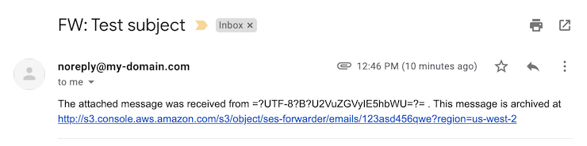
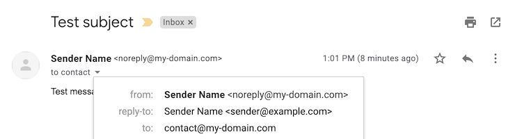

# AWS Email Forwarder

Inspired by [this article](https://aws.amazon.com/blogs/messaging-and-targeting/forward-incoming-email-to-an-external-destination/) from the AWS Blog and by [arithmetric/aws-lambda-ses-forwarder](https://github.com/arithmetric/aws-lambda-ses-forwarder) (unmaintained).

What it does:  
Receive mail at `*@my-domain.com` and forward it to `me@mail-provider.com`.

## Install
Follow the instructions from the [AWS article](https://aws.amazon.com/blogs/messaging-and-targeting/forward-incoming-email-to-an-external-destination/) and replace their Lamba function code by the code found in [lambda_function.py](lambda_function.py).

## Why?
Because the AWS script forwards you this:

When you want this:

Note: the email comes from `noreply@my-domain.com` but the `Reply-To` header is set to the original sender's address, so your response will go to the correct recipient.
